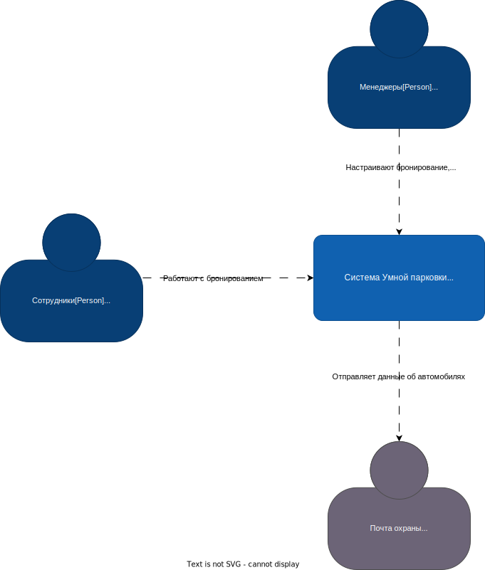
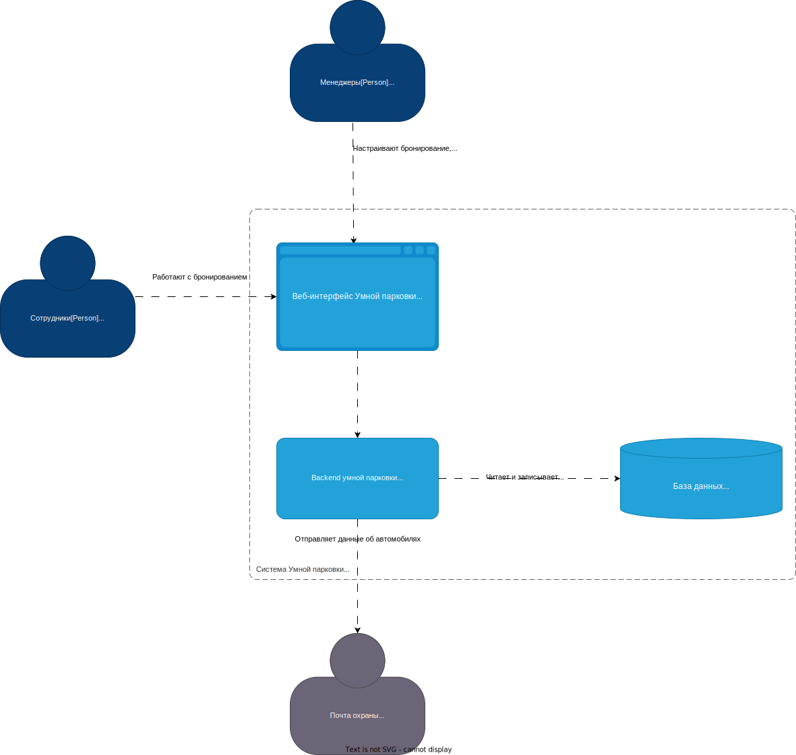

# Система бронирования парковки "ParkApp"

**Архитектор**: Павел Рябых / Яндекс Практикум  
**Дата:** 10 Октября 2023

### История версий

> ***Опционально***  
> Отражает изменения, внесенные в документ, включая дату, версию, описание изменения и автора

| Дата | Автор | Что изменилось | 
| :-: | :-: | :-: |
| 16.08.2023| Иван Иванов | Все | 

### Краткий обзор

> Краткий обзор всей архитектуры решения. Должен предоставлять общее представление о целях проекта, ключевых особенностях, основных преимуществах, ожидаемых затратах и потенциальных рисках. Главным образом предназначено для лиц, принимающих решения, которые могут не углубляться в детальные разделы документа.

##### Название проекта: ПЛАТФОРМА ОНЛАЙН-РИТЕЙЛА NEXTGEN 

Современный рынок электронной коммерции требует скорости, гибкости и ориентированного на пользователя подхода. 
Проект "Платформа онлайн-ритейла NextGen" - это наш стратегический ответ на эти требования, гарантируя, что мы не только соответствуем текущим стандартам рынка, но и готовы к будущим изменениям в онлайн-ритейле. 

##### Цель

Переход от нашей устаревшей системы онлайн-продаж к надежной, масштабируемой и дружелюбной платформе, которая улучшает опыт покупателя, безупречно интегрируется с нашими системами управления цепочкой поставок и поддерживает ожидаемый рост в течение следующих пяти лет. 

##### КЛЮЧЕВЫЕ ОСОБЕННОСТИ

- ***АДАПТИВНЫЙ ВЕБ-ДИЗАЙН:*** Обеспечивает оптимальный просмотр на различных устройствах, от мониторов компьютера до мобильных телефонов.
- ***ИНТЕГРИРОВАННАЯ СИСТЕМА РЕКОМЕНДАЦИЙ НА ОСНОВЕ ИСКУССТВЕННОГО ИНТЕЛЛЕКТА:*** Персонализирует покупательский опыт, предлагая продукты на основе истории просмотров и покупок. 
- ***БЕСШОВНАЯ ИНТЕГРАЦИЯ С ПЛАТЕЖНЫМИ СИСТЕМАМИ:*** Предлагает множество вариантов оплаты, улучшая процесс оформления заказа. 
- ***ПРЕИМУЩЕСТВА:*** Ожидаемый рост онлайн-продаж на 25% благодаря улучшенному пользовательскому опыту. Снижение числа шагов для заказа за счет оптимизации процесса оформления. Расширенные возможности аналитики данных, предоставляющие информацию о поведении и предпочтениях клиентов. 
- ***ОРИЕНТИРОВОЧНАЯ СТОИМОСТЬ:*** Общие инвестиции в этот переход оцениваются в $1,2 млн, с прогнозируемой окупаемостью инвестиций в 40% в течение следующих трех лет. 
- ***РИСКИ:*** Возможные краткосрочные перебои во время перехода от устаревшей системы. Необходимость обучения персонала новой платформе. 

Платформа онлайн-ритейла NextGen - это не просто технологическое обновление, это инвестиции в наше будущее, гарантируя, что мы останемся на передовой инноваций в области электронной коммерции и продолжим эффективно обслуживать наших клиентов.

### Введение

> В этом разделе представлена ключевая терминология по архитектуре решения и границы проекта. Он разработан для того, чтобы все заинтересованные стороны имели общее понимание, и не было двусмысленностей в терминах или границах проекта.

### Ключевые термины, определения, аббревиатуры

> ***Опционально***  
> Представляет любую специализированную терминологию, сокращения или аббревиатуры, используемые в документе. Это помогает обеспечить ясность и понимание для всех заинтересованных сторон.

| Термин | Определение |
|:-:|:-|
| СУБД | Система управления базами данных |

### Границы проекта

> Четко определяет, что включено в проект, и, что не менее важно, что исключено. Это устанавливает четкие границы для целей проекта, результатов, функций и функциональных возможностей.

##### Включено: 
- Разработка нового интерфейса платформы электронной коммерции. 
- Интеграция системы рекомендаций на основе искусственного интеллекта. 
- Перенос существующих пользовательских данных в новую систему. 
##### Исключено: 
- Пересмотр системы управления цепочкой поставок на бэкенде. 
- Разработка нового мобильного приложения.

### Требования

> В этом разделе рассматриваются конкретные требования к проекту, кто в нем участвует и контекст, в котором решение будет разработано и предоставлено.

#### Заинтересованные стороны

> Определяет и описывает основные группы или отдельных лиц, которые заинтересованы/участвуют в проекте, его результатах или затрагиваются его итогами. Важно понимать их потребности, опасения и влияние. 

> [!NOTE]
>  - **Сторона:** Указывает на группу или категорию, к которой принадлежит заинтересованная сторона. Это может быть отдел, группа пользователей или внешняя организация. 
>  - **Имя:** Если применимо, это было бы конкретное лицо, представляющее сторону-участника, особенно актуально для ключевых лиц, принимающих решения, или основных контактных лиц. 
>  - **Роль/Должность:** Определяет основную функцию или отношение участника к проекту. 
>  - **Интересы/Опасения:** Описывает конкретные интересы, риски или потребности, которые участник может иметь в отношении проекта.

| Сторона | Имя | Роль/Должность | Интересы/Опасения |
| :-: | :-: | :-: | :- |
| Инженерная команда | Иван Иванов | Архитектор | Согласованные и подробно описанные требования |

#### Функциональные требования

| Группа            | ID     | Описание                                                                                                                                                                                                                                   | Приоритет   |
| ----------------- | ------ | ------------------------------------------------------------------------------------------------------------------------------------------------------------------------------------------------------------------------------------------ | ----------- |
| Аутентификация    | FR-001 | Неаутентифицированный пользователь при открытии любой страницы сайта редиректится на страницу входа (ввода логина).                                                                                                                        | Обязательно |
| Аутентификация    | FR-002 | Неаутентифицированный пользователь может аутентифицироваться на странице логина, введя соответствующий login, который можно отправить кнопкой "Войти как сотрудник" или кнопкой "Войти как менеджер"                                       | Обязательно |
| Аутентификация    | FR-003 | После ввода логина пользователь редиректится на страницу с бронированием парковочного места                                                                                                                                                | Обязательно |
| Аутентификация    | FR-004 | После ввода логина пользователь редиректится на страницу, которую он запрашивал перед редиректом на страницу логина                                                                                                                        | Возможно    |
| Бронирование      | FR-005 | Аутентифицированный пользователь при переходе на страницу логина редиректится на страницу с бронированием парковочного места                                                                                                               | Желательно  |
| Бронирование      | FR-006 | Аутентифицированный пользователь может выйти из системы с последующим редиректом на страницу логина                                                                                                                                        | Желательно  |
| Бронирование      | FR-007 | На странице бронирования парковочного места пользователь видит схему парковки и доступные парковочные места на завтра с возможность выбрать другую дату не раньше завтрашней                                                               | Обязательно |
| Бронирование      | FR-008 | Пользователь может забронировать парковочное место из списка доступных, передав номер автомобиля при выборе парковочного места, если на момент бронирования на балансе > 0 дней                                                            | Обязательно |
| Бронирование      | FR-009 | Одно парковочное место нельзя забронировать дважды (одним пользователем или разынми)                                                                                                                                                       | Обязательно |
| Бронирование      | FR-010 | Пользователь может забронировать только одно парковочное место на определенный день                                                                                                                                                        | Желательно  |
| Бронирование      | FR-011 | На каждой странице приложения пользователю доступна навигация, которая включает в себя гиперссылки, позволяющие пользователю перемещаться по системе. А именно следующие ссылки: \- страница бронирования \- история бронирований | Обязательно |
| Бронирование      | FR-012 | Пользователь может посмотреть историю своих бронирований, отсоритрованную в порядке убывания по дате бронирования                                                                                                                          | Обязательно |
| Бронирование      | FR-013 | В истории бронирования пользователь может отменить бронирование в любой день до дня следующего после дня записи.                                                                                                                           | Обязательно |
| Бронирование      | FR-014 | При успешном бронировании у пользователя списывается день с баланса бронирований                                                                                                                                                           | Обязательно |
| Бронирование      | FR-015 | При отмене бронирования до дня записи пользователю возвращается один день на баланс за отмененное бронирование                                                                                                                             | Обязательно |
| Бронирование      | FR-016 | При отмене бронирования в день записи к балансу не прибавляется день за отмененное бронирование                                                                                                                                            | Обязательно |
| Бронирование      | FR-017 | На каждой странице приложения пользователь видит баланс доступных бронирований на текущий месяц                                                                                                                                            | Обязательно |
| Бронирование      | FR-018 | В начале каждого месяца баланс устанавливается в значение равное месячному лимиту текущего пользователя                                                                                                                                    | Обязательно |
| Бронирование      | FR-019 | Пользователю доступно бронирование только в текущем месяце                                                                                                                                                                                 | Обязательно |
| Бронирование      | FR-020 | На каждой странице приложения пользователь видит доступный лимит бронирований на текущую неделю                                                                                                                                            | Не будет    |
| Бронирование      | FR-021 | Пользователь может забронировать только свободное место                                                                                                                                                                                    | Обязательно |
| Бронирование      | FR-022 | Пользователь может отменить только своё забронированное место                                                                                                                                                                              | Обязательно |
| Бронирование      | FR-023 | Пользователь может перенсти созданное бронирование на другую доступную дату для этого парковочного места или для другого свободного парковочного места                                                                                     | Возможно    |
| Администрирование | FR-024 | Для пользователя с ролью менеджер в навигации также доступны следующие гипер ссылки: \- список сотрудников \- настройка схемы парковки \- лимиты бронирования \- настройка шаблона письма                                      | Обязательно |
| Администрирование | FR-025 | Пользователь может видеть список сотрудников на соответствующей странице, где ему также доступны кнопки удаления сотрудника, добавления сотрудника, получение информации о сотруднике                                                      | Обязательно |
| Администрирование | FR-026 | Пользователь может удалить сотрудника. Сотруднику присваивается статус deleted, а все активные бронирования отменяются.                                                                                                                    | Обязательно |
| Администрирование | FR-027 | Пользователь может добавить сотрудника введя соответствующий логин.                                                                                                                                                                        | Обязательно |
| \-                | FR-028 | При добавлении сотрудника его логин должен быть уникальным. Пользователь не может создать уже существующий логин в системе.                                                                                                                | Обязательно |
| \-                | FR-029 | При регистрации сотрудника ему устанавливается роль Сотрудник                                                                                                                                                                              | Обязательно |
| Администрирование | FR-030 | Пользователь может посмотреть информацию о любом сотруднике из списка сотрудников, которая включает в себя баланс сотрудника, месячный лимит и историю бронирований                                                                        | Обязательно |
| Администрирование | FR-031 | Пользователь может посмотреть список добавленных парковочных мест, схему парковки, а также кнопки по добавлению парковочного места, удалению парковочного места из списка, загрузки схемы парковки                                         | Обязательно |
| Администрирование | FR-032 | Пользователь может удалить парковочное место. Устанавливается статус delete, а все ассоциированные бронирования переводятся в статус canceled                                                                                              | Обязательно |
| Администрирование | FR-033 | Если удаляется парковочное место, то все ассоциированные бронирования переходят в статус canceled, при котором возврат дней на баланс происходит по правилам, описанным в требованиях FR-015, FR-016                                       | Возможно    |
| Администрирование | FR-034 | Пользователь может загрузить схему парковки                                                                                                                                                                                                | Обязательно |
| Администрирование | FR-035 | Пользователь может добавить парковочное место                                                                                                                                                                                              | Обязательно |
| \-                | FR-036 | Код парковочного места должен быть уникальным                                                                                                                                                                                              | Обязательно |
| Администрирование | FR-037 | Пользователь может настроить общие лимиты бронирования на месяц, которые будут относиться к каждому сотруднику, если этот лимит не был переопределен в профиле сотрудника                                                                  | Обязательно |
| Администрирование | FR-038 | Пользователь может настроить персональные лимиты для каждого сотрудника в разделе информации о бронировании сотрудника                                                                                                                     | Обязательно |
| Администрирование | FR-039 | Пользователь может установить настройки повторяющейся пересылки номеров автомобилей, где указывает шаблон письма для отправки охране, email адресата и время для каждодневной отправки.                                                    | Обязательно |
| \-                | FR-040 | Результатом установки шаблона и времени отправки письма является каждодневная отправка письма (email) с бронированиями на завтрашний день.                                                                                                 | Обязательно |
| Администрирование | FR-041 | Пользователь может зарегистрироваться в системе по секретному коду, передав секретный код и логин, который нужно зарегистрировать.                                                                                                         | Обязательно |
| Администрирование | FR-042 | При регистрации менеджера ему устанавливается роль Менеджер и Сотрудник                                                                                                                                                                    | Обязательно |
| \-                | FR-043 | Каждая сущность в системе прямо или косвенно должна быть связана с организацией. Данная связь предполагает, что пользователи одной организации могут взаимодействовать со своими сущностями никак не влияя на сущности других организаций. | Не будет    |

#### Нефункциональные требования

| Группа                 | ID      | Описание                                                                                                                                                                                   | Приоритет   |
| ---------------------- | ------- | ------------------------------------------------------------------------------------------------------------------------------------------------------------------------------------------ | ----------- |
| Безопасность           | NFR-001 | Пользователь не может использовать функционал системы без предварительной аутентификации                                                                                                   | Обязательно |
| Безопасность           | NFR-002 | В системе предусмотрены две роли: сотрудник и менеджер. В зависимости от роли пользователя ему доступен различный функционал.                                                              | Обязательно |
| Безопасность           | NFR-003 | Каждый пользователь в системе относится к определенной организации. Пользователь из одной организации никак не может взаимодействовать с данными пользователей из других организаций.      | Обязательно |
| Производительность     | NFR-004 | Система должна выдерживать нагрузку N < 100 RPS                                                                                                                                            | Обязательно |
| Доступность            | NFR-005 | Интерфейс должен реагировать на действия пользователя не более чем за 1000 мс                                                                                                              | Обязательно |
| Доступность            | NFR-006 | Система должна быть доступна 95% времени                                                                                                                                                   | Обязательно |
| Удобство использования | NFR-007 | Формат указания времени HH:MM                                                                                                                                                              | Обязательно |
| Удобство использования | NFR-008 | Единица измерения для баланса пользователя - количество дней.                                                                                                                              | Обязательно |
| Удобство использования | NFR-009 | Формат письма для передачи автомобилей, которые нужно пропустить на парковке:  «Добрый день! Сегодня к нам приедут вот такие машины — Х, Y, Z. Пропустите их, пожалуйста, они к нам» | Обязательно |
| Удобство использования | NFR-010 | Формат даты: \`2023-08-15" (ISO 8601)                                                                                                                                                      | Обязательно |

#### Ограничения

| Тип             | ID | Описание                                                                                                                |
| --------------- | -- | ----------------------------------------------------------------------------------------------------------------------- |
| Сроки           |    | Продукт должен быть готов через 30 октября 2023                                                                         |
| Ресурсы         |    | В неделю есть 5 человеко-часов на разработку продукта.                                                                  |
| Границы проекта |    | В проект не будет включено разделение на организации. Изначально продуктом сможет пользоваться только одна организация. |

#### Предположения

> Документируются все предполагаемые факты или условия, которые будут влиять на решения проекта. Они часто служат основой для рисков, так как предположения часто включают в себя некоторую степень неопределенности.

> [!NOTE]
> - **ID:** Уникальный идентификатор для каждого предположения для легкого его учета.
> - **Описание:** Четкое и краткое изложение предположения.

| ID | Описание |
| :-: | :- |
| A-001 | Пользовательский трафик не увеличится более чем на 30% в первые шесть месяцев после развертывания. |
| A-002 | Существующая IT-команда обладает необходимыми навыками для поддержки и обслуживания новой платформы. |
| A-003 | Сторонние поставщики предоставят необходимую документацию по API вовремя. |

---
### Текущая архитектура

>***Опционально***
>Этот раздел предоставляет подробное описание текущего состояния архитектуры. Для обеспечения последовательности в представлении и упрощения сравнения с "Целевой архитектурой" рекомендуется использовать те же разделы/подразделы, что и в "Целевой архитектуре".

---
## Целевая архитектура

### Диаграмма контекста (C1):

Предполагается, будет реализовано приложение, куда сотрудник сможет зайти и забронировать место, отправив дату, номер машины. Также будет способ администрировать всё это на базовом уровне — вносить новые парковочные места, смотреть историю бронирований.

### Диаграмма контейнеров (C2):

### Диаграмма компонентов (C3):

### В ходе разработки технического проекта были приняты и зафиксированы следующие архитектурные решения:
| ID  |   Дата  |   Статус  |   Участники  |   Решения    |
|-----|---------|-----------|---------------|---------------|
| [ADR-001] | [09.10.2023] | [Принято] | [Рябых Павел Александрович]         | [Выбор монолитной архитектуры для нашей системы](static/adr-001.md)     |
| [ADR-002] | [09.10.2023] | [Принято] | [Рябых Павел Александрович]         | [Использование Spring Boot для разработки](static/adr-002.md)     |
| [ADR-003] | [09.10.2023] | [Принято] | [Рябых Павел Александрович]         | [Использование PostgreSQL для нашей базы данных](static/adr-003.md)     |

##### Обзор

>Краткое резюме общей целевой архитектуры, создающее основу для более подробных представлений, которые следуют далее.

##### Функциональное Представление

>***Опционально***  
>Описывает функциональные элементы системы, их обязанности, взаимодействия и отношения.

##### Развертывание

>***Опционально***  
>Описывает физическое и виртуальное развертывание программных компонентов, учитывая аспекты масштабирования, распределения и механизмов отказоустойчивости.

##### Процессы

>***Опционально***  
>Описывает динамическое поведение системы, изображая параллельные процессы, синхронизацию и последовательность событий.

##### Данные

>***Опционально***  
>Описывает аспекты данных системы, включая модели данных, механизмы хранения, отношения и потоки данных.

##### Безопасность

>***Опционально***  
>Описывает меры и стратегии для обеспечения безопасности системы. Это может включать в себя детали об аутентификации, авторизации, шифровании, обнаружении вторжений и т. д.

##### Производительность

>***Опционально***  
>Описывает стратегии для достижения желаемых показателей производительности. Это может охватывать аспекты, такие как задержка, пропускная способность, распределение нагрузки и техники оптимизации.

##### Сетевое взаимодействие

>***Опционально***  
>Описывает аспекты связи, топологии сети и протоколы, учитывая пропускную способность, задержку и другие сетевые факторы.

---
### Альтернативные варианты

>***Опционально***  
>В этом разделе описываются альтернативные решения или архитектуры, которые рассматривались на этапе планирования. Детализация этих вариантов и причины их невыбора помогают обеспечить ясность и прозрачность в процессах принятия решений.

##### 1. Развертывание на собственных серверах
- **Описание:** Основные характеристики и особенности этой альтернативы.
- **Преимущества:** Преимущества или сильные стороны.
- **Ограничения:** Возможные проблемы или недостатки.
- **Причина отказа от варианта:** Объяснение, почему этот вариант не был выбран.
##### 2. Гибридное облачное решение
- **Описание:** Основные характеристики и особенности этой альтернативы.
- **Преимущества:** Преимущества или сильные стороны.
- **Ограничения:** Возможные проблемы или недостатки.
- **Причина отказа от варианта:** Объяснение, почему этот вариант не был выбран.

##### Критерии оценки

>***Опционально***  
>Опишите метрики или критерии, используемые для оценки каждого варианта. Это может включать в себя стоимость, масштабируемость, простоту внедрения, совместимость с существующими системами и т. д.

##### Итог

>***Опционально***  
>Заключение об рассмотренных альтернативах и причин, по которым было принято окончательное решение. В этом разделе также можно указать любые планы по повторному рассмотрению этих альтернатив в будущем, если это актуально.

---
### Риски

>Этот раздел описывает потенциальные риски, которые могут повлиять на успешную реализацию или функционирование решения. Риски следует регулярно пересматривать, переоценивать и обновлять по мере продвижения проекта. Для каждого риска следует предоставить стратегии смягчения и реагирования.

> [!NOTE]
> - **ID Риска:** Уникальный идентификатор для каждого риска для легкого его учета (например, R-001).
> - **Описание:** Краткое описание риска.
> - **Влияние:** Серьезность риска в случае его реализации. Обычно оценивается как НИЗКОЕ, СРЕДНЕЕ, ВЫСОКОЕ или КРИТИЧНОЕ.
> - **Вероятность:** Вероятность возникновения риска. Обычно категоризируется как НИЗКАЯ, СРЕДНЯЯ или ВЫСОКАЯ. 
> - **Стратегия смягчения:** Проактивные меры, принимаемые для предотвращения или снижения вероятности или воздействия риска.
> - **Стратегия реагирования:** Реактивные меры, запланированные на случай реализации риска.

| ID Риска | Описание | Влияние | Вероятность | Стратегия смягчения | Стратегия реагирования |
| :-: | :- | :-: | :-: | :- | :- |
| R-001 | Задержка в получении необходимых лицензий на программное обеспечение | Низкая | Средняя | Договориться и утвердить лицензии до начала разработки | Иметь резервный список альтернативного программного обеспечения или инструментов |

---

### Бюджет и дорожная карта

>Этот раздел предоставляет стратегический взгляд на то, как будет внедрено решение, детализируя ключевые этапы и планируемые действия на пути. Это выравнивает ожидания и предоставляет основу для отслеживания и измерения прогресса.

#### Дорожная карта

>Для представления временной шкалы проекта можно использовать диаграмму Ганта высокого уровня или аналогичный визуальный инструмент. На нем следует выделить основные этапы, действия и соответствующие временные рамки. Если предполагается фазовый подход, укажите фазы и связанные с ними действия.

#### Планирование ресурсов

> В этом подразделе следует подробно описать необходимые ресурсы, как в плане рабочей силы, так и в плане инфраструктуры. Укажите роли, необходимые навыки и оцененные затраты в человеко-часах или человеко-днях. Не забудьте включить ресурсы для деятельности, не связанной с разработкой, такой как обучение, документация и поддержка. 

| Роль | Цена за месяц (USD) | Янв | Фев | Мар | Апр | Май | Июн | Итог (USD) |
| :- | -: | -: | -: | -: | -: | -: | -: | :-: |
|**Архитектор Решений**|$10,000|0.4|0.4|0.2|0.2|-|-|$22,000|
|**Бизнес Аналитик**|$8,000|0.8|0.7|0.6|0.5|0.3|0.2|$42,600|
|**Разработчик (Backend)**|$7,500|2.0|2.0|2.0|2.0|2.0|2.0|$90,000|
|**Разработчик (Frontend)**|$7,000|1.0|1.0|1.0|1.0|1.0|1.0|$42,000|
|**DevOps**|$8,000|0.5|1.0|1.0|0.2|0.2|0.2|$25,600|
|**Дизайнер**|$6,500|0.7|0.8|0.5|0.5|0.2|-|$26,450|
|**Проектный Менеджер**|$9,000|0.5|0.5|0.5|0.5|0.5|0.5|$32,40|
|**Тестировщик**|$7,200|$32,40|$32,40|$32,40|$32,40|$32,40|$32,40|$41,760|

Предполагаемый общий бюджет на разработку SaaS MVP в течение 6 месяцев, на основе подробного распределения ресурсов, составляет $323,810
